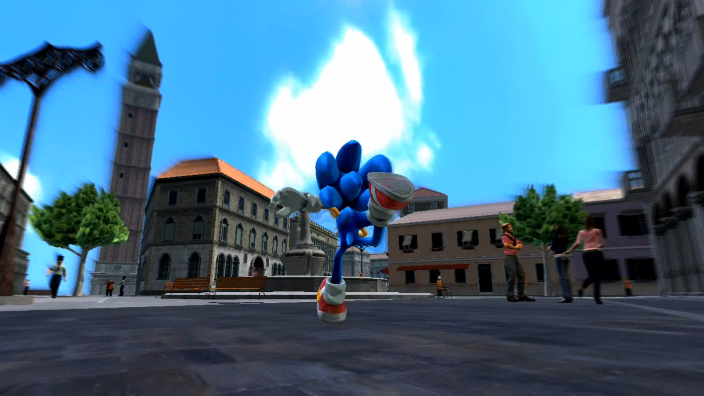
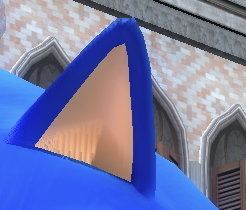

During the process of building [Marathon Recompiled](https://github.com/sonicnext-dev/MarathonRecomp), we've ended up digging deep into many of Sonic 06's core systems, including the rendering. The appearance of 06's various areas varies from pretty good, like in Crisis City, to utterly flat and depressing in Castle Town.


*Crisis City has reflections, particle effects, dramatic lighting.*


*Castle Town just makes me sad.*

It really makes you wonder what exactly went wrong? If you look at what limited footage we have of beta content, we can see many effects that aren't present in the final game. Kingdom Valley had full bump maps, Castle Town had more complex geometry and plants, and New City's collision implies a very different building layout at some point in development.


*Beta Castle Town had proper lighting and shadows. [Source: TCRF](https://tcrf.net/Prerelease:Sonic_the_Hedgehog_(2006))*

It turns out, much of the cut content is actually still in the game, but is simply not enabled for performance reasons in vanilla. Even with the cut-back visuals, the game struggles to reach target FPS on real hardware. It's not surprising that given the crunch Sonic Team were under to get the game out the door, these features were among the first to go.

# Shaders

How exactly were these features disabled, though? It comes down to the many different shader variants used throughout. Most things in Sonic 06 are rendered using either the `Terrain` or `Billboard` shaders (despite the name, `Billboard` is not actually billboard-ed). Both of these have many variants, each with different feature levels numbered 00-07. As a general rule, the higher the number, the better the feature set. These shaders have not been entirely decompiled yet, so I can't account for every difference with 100% certainty, but here is a rough feature table for the `Billboard` variants. CSM here stands for cascaded shadow maps, the shadow technique used by 06.

|    | Lighting | CSM | Point Lights | Dual-Texture Blend |
|----|----------|-----|--------------|--------------------|
| 00 | None     | No  | No           | No                 |
| 01 | Vertex   | No  | Yes          | No                 |
| 02 | Vertex   | No  | No           | No                 |
| 03 | Vertex   | Yes | Yes          | No                 |
| 04 | Pixel    | Yes | No           | No                 |
| 05 | Pixel    | No  | No           | Yes                |
| 06 | Pixel    | No  | Yes          | Yes                |
| 07 | Pixel    | Yes | Yes          | Yes                |

Want to take a guess as to which is the most used shader in the game? That's right, `Billboard02`. Not quite the worst one, but definitely one of the worst. So yes, *the most used shader in the game* only has per-vertex lighting, no CSM support, and no point lights. If you're wondering why so many things look so dull, this is why. Most of the game is not rendered with anything but the most basic albedo textures and ambient lighting.

If you're curious about how much each shader is used and where, I've made a [handy table](https://gist.github.com/IsaacMarovitz/6eb288fa79e7fd1cb5034300d6a33305), with descriptions of each shader available on [HedgeDocs](https://hedgedocs.com/index.php/Sonic_the_Hedgehog_(2006)_Shaders).

Unfortunately, because of the different I/O layouts between the variants, swapping them out is not as easy as you'd hope. My current attempts to do so have been largely unsuccessful, mostly just resulting in the various techniques breaking in one way or another. Additionally, the textures used for each material are defined in an object's `.xno` file. It may be the case that some `.xno`s simply do not reference their other maps like normal and bump maps, despite them still being in the game files, and so swapping the shaders would not be enough.


*Castle Town with Billboard07 shader. Shadows do not apply to buildings correctly.*

# Shadow Maps

So about those shadow maps, they're not free from problems either. The game is set up for a maximum of 4 cascades. Each cascade is used for a portion of the view along the camera's frustum, keeping the amount of pixels used to resolve shadows relatively consistent across distances. However, it seems CSM was also the target of some last-minute performance hack-n-slashing.

The level of cascades used is defined by `GenerateCSMLevels` and `GenerateCSMObjects`. `Levels` generally refers to terrain/static elements, while `Objects` refers to well... other objects. Most areas will use the full 4 cascades, except `twn_a` and a few test levels where `GenerateCSMLevels` is downgraded to 3 and `GenerateCSMObjects` to just 2, significantly shortening the distance shadows render at. Multiplayer has this reduced cascade count everywhere.

Even when shadows do render correctly, they're prone to severe shadow acne, a common artifact when using these sorts of techniques. This is usually resolved by adding a small epsilon value to shadow map samples, but Sonic Team didn't do this, and I don't have the knowledge of the shaders yet to attempt to add this.


*Shadow acne on Sonic's ear.*

Shadows are also occasionally ill-defined in vanilla. Objects can set whether they contribute to shadow maps, and they sometimes get this wrong, leading to problems like Sonic's Crisis City snowboard having no shadow, and Elise's skirt missing a shadow in one of Sonic's story cutscenes. These are not as easily patchable, as it would likely require direct edits to the objects themselves, or a complicated hook to find and correct objects in the render code itself.

# Point Lights

This is one of the sadder cuts in my opinion. For what it's worth, Sonic 06 *in theory* has a pretty flexible lighting system. There's a couple of fixed ambient lights defined for every object, and then several point lights. These are meant to provide additional small details for objects like torches, they don't cast shadows, and are rather inexpensive to render.

```hlsl
shared struct
{
    float4 Position;
    float4 Color;
    float4 Attenuation;

} g_PointLights[2]
```

Sonic Team limited the number of point lights per-object to 2, that means at any given time, only 2 lights literally have the space in shader inputs to be rendered. Ordinarily, this sort of limitation would be fine, most forward renderers will have this kind of limit, so long as the designers remained cognisant of the limit when designing stages. Well, uh, they didn't.

Some stages like Kingdom Valley obey the limit pretty faithfully, and then stages like Flame Core and Dusty Desert utterly blow the limit out of the water, attempting to render 8+ lights per object. Needless to say, this doesn't work out. The renderer gets confused, and lights will "fight" for priority, causing some to appear or disappear semi-randomly.


*Overloaded point lights in Flame Core. Only lights on the left side of the path render.*

Sonic Team attempted to provide a general optimisation for point lights, and allocate them effectively to nearby objects, but something in this check went wrong. I suspect a combination of the limit being sharply lowered later in development, and the switching of many per-pixel lit objects to per-vertex, which can vastly alter the contribution area of a point light. The result is point lights rarely work at all in vanilla, even in stages that respect the limit.

In the recomp, we are able to patch out most of the optimisation that breaks them, allowing point lights to render much more stable than in vanilla, however we are *still* limited to the 2 light limit. The lighting calculations responsible for adding point light contribution are all unrolled/inlined in the final shader bytecode, which makes identifying and modifying this code tricky as it can look different from one shader to the next. This is an area I want to tackle in the future.

# Planar Reflections

Did you know Sonic 06 had real-time planar reflections? Hint: We saw them earlier in Crisis City. I actually don't have much to complain about here, generally they work really well and add a lot of realism to a scene. Of course, the resolution is severely limited in vanilla to 1/4 the resolution of the framebuffer, but that's easily patched. There is one area where the game's visuals get screwed over, and that's in multiplayer.


*Murky fixed cubemap reflection in Kingdom Valley.*

To save having to render expensive planar reflections __twice__ in multiplayer, Sonic Team opted to just remove them entirely and replace them with static cubemaps. The problem is these cubemaps are pretty meh. Kingdom Valley goes from looking awesome to more like a depressed swamp. Well no problem, we can just patch it in right? Unfortunately due to how the rendering code works this isn't so easy.

Sonic 06 uses Lua scripting to build the render graph, and different modes have different scripts. It's a pretty cool and flexible system, when it works. As expected, singleplayer and multiplayer have their own render scripts, `render_gamemode.lua` and `render_gamemode_multi.lua` respectively.

```lua
function Build(_ARG_0_)
  CreateCSM(_ARG_0_)
  RenderCSM(_ARG_0_, GenerateCSMLevels, GenerateCSMObjects)
  ApplySceneParams(_ARG_0_)
  --
  RenderReflection(_ARG_0_)
  --
  PrepareColorRender(_ARG_0_)
  SetFrameBufferObjectOnce(_ARG_0_, "framebuffer0", "depthstencil", "all", 0, 0, 0, 0)
  SetViewport(_ARG_0_, 0, 0, GetSurfaceWidth(_ARG_0_, "framebuffer0"), (GetSurfaceHeight(_ARG_0_, "framebuffer0")))
  SetCurrentCamera(_ARG_0_, "main")
  AutoSetAspect(_ARG_0_)
  Zpass(_ARG_0_, "depthbuffer0", "depthstencil", "main")
  RenderMain(_ARG_0_, "framebuffer0", "depthstencil")
  PostColorRender(_ARG_0_)
  Capture(_ARG_0_, "framebuffer0")
  MakeBloom(_ARG_0_)
  ApplyBloom(_ARG_0_)
  SetCurrentCamera(_ARG_0_, "mainglare")
  AutoSetAspect(_ARG_0_)
  RenderWorld(_ARG_0_, "glare")
  RenderPostprocess(_ARG_0_, "framebuffer0")
  SetFrameBufferObject(_ARG_0_, "postprocess_output", "depthstencil", "none", 0, 0, 0, 0)
  SetCurrentCamera(_ARG_0_, "mainafterpp")
  AutoSetAspect(_ARG_0_)
  RenderWorld(_ARG_0_, "afterpp", "all", "transparent")
  SetFrameBufferObjectOnce(_ARG_0_, "backbuffer", "null", "color", 0, 0, 0, 0)
  SetFrameBufferObject(_ARG_0_, "backbuffer", "null", "none", 0, 0, 0, 0)
  ResetViewport(_ARG_0_)
  if EnableRasterizeBlur then
    RasterizeBurnoutBlur(_ARG_0_, "postprocess_output", "main", 1)
  else
    Rasterize(_ARG_0_, "postprocess_output")
  end
  RenderAfterPostprocess(_ARG_0_)
  Render2D(_ARG_0_)
end
```

In `render_gamemode.lua` we can see that crucial `RenderReflection()` call, which is unfortunately entirely absent from `render_gamemode_multi.lua`. As a result, attempting to enable the realtime reflections in multiplayer will just leave us with a black void rather than pretty reflections.

We can't just swap out `render_gamemode_multi.lua` for `render_gamemode.lua` either. The multiplayer renderer has special steps for creating the split-screen, essentially two framebuffers, so for multiplayer to render correctly, the provided render graph needs to be able to render both framebuffers. *Even* if you modify the multiplayer renderer to have `RenderReflection`, it's not set up to work in this split-screen environment, and will, again, not work as intended. As it stands this quickly becomes a rabbit hole that's not easy to resolve. If in future we have an easier way to apply Lua patches, I may revisit this.

# Can we fix it?

Maybe. Several of these problems have been at least *partially* addressed, but I've yet to figure out the shader edits that would be needed to get us to that beta footage goodness. Some of these fixes are largely, out of scope for the recomp, but whether fixes make it or not, we're still learning a ton about how this game works on the backend. That still directly contributes to future improvements and patches.

This game has much, much more to give, and it's honestly sad that Sonic Team were not given the time to finish it. There's many things that I didn't get in to in this article including the insanity of the character shader, or the lack of occlusion culling, but it's long enough already. Have fun with this silly game and happy early 20th anniversary.

*Thank you to [Gordon Ramsay](https://gamebanana.com/members/1885816) for fact checking.* 
